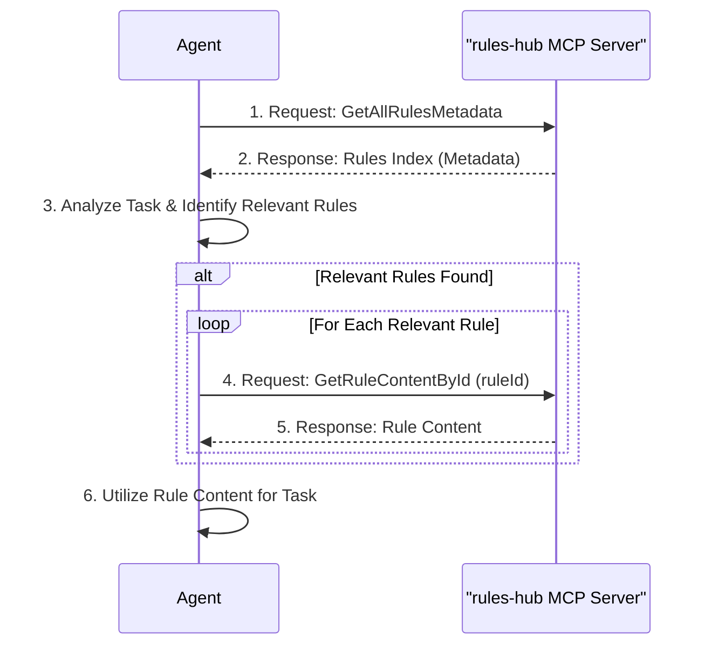

# AgentRulesHub MCP Server

**Note: this is dotnet implemenatation. main development in python can be found at [ContextualAgentRulesHub Repository](https://github.com/oshvartz/ContextualAgentRulesHub)**

AgentRulesHub is an MCP (Model Context Protocol) server designed to manage and provide contextual rules for AI agents. It allows agents to dynamically retrieve rules based on various criteria, such as programming language or specific rule identifiers.

## Motivation

Managing agent rules effectively can be challenging. Sharing rules across different agents or projects often leads to inconsistencies and difficulties in maintaining a centralized rule set. Furthermore, AI agents often operate with limited context windows. Sending a large, undifferentiated set of rules can consume valuable context space. AgentRulesHub aims to address these issues by:

-   Providing a structured way to organize and access rules.
-   Enabling agents to retrieve only the rules relevant to their current task, thus minimizing context length and improving efficiency.

## Task Flow

This section describes the typical flow of an AI agent interacting with the AgentRulesHub MCP server to retrieve and utilize rules for a given task.

1.  **Task Initiation**: An agent (e.g., Cline) begins a new task.
2.  **Retrieve Rule Index**: The agent queries the `rules-hub` MCP server using the `GetAllRulesMetadata` tool. This provides an index of all available rules, including their IDs, descriptions, languages, and tags.
3.  **Identify Relevant Rules**: Based on the current task's context (e.g., programming language, keywords, objectives) and the metadata received, the agent analyzes the rule index to identify which rules are relevant.
4.  **Retrieve Rule Content**: If relevant rules are identified, the agent uses the `GetRuleContentById` tool for each relevant rule ID to fetch its specific content.
5.  **Utilize Rules**: The agent incorporates the content of the retrieved rules to guide its actions, improve its output, or ensure adherence to specific guidelines for the task at hand.



## Features

-   **Dynamic Rule Retrieval**: Access rules based on language or ID.
-   **YAML-based Rule Storage**: Rules are defined in YAML files.
-   **Configurable Rule Sources**: Specify locations for rule files via configuration.
-   **MCP Integration**: Exposes functionality as tools consumable by MCP clients.

## Configuration

To use the AgentRulesHub MCP server, you need to configure it in your MCP client's settings file (e.g., `cline_mcp_settings.json` for the Cline VS Code extension).

Add the following configuration block to your MCP settings:

```json
{
  "mcp_servers": {
    "rules-hub": {
      "autoApprove": [],
      "disabled": false,
      "timeout": 300,
      "command": "dotnet",
      "args": [
        "<path_to_your_AgentRulesHub_build_directory>/AgentRulesHub.dll"
      ],
      "env": {
        "RuleSources:Sources:0:LoaderType": "YamlFile",
        "RuleSources:Sources:0:Settings:Path": "<path_to_your_rules_directory>"
      },
      "transportType": "stdio"
    }
  }
}
```

**Explanation of Configuration Fields:**

*   `"rules-hub"`: A unique name for this MCP server instance.
*   `"command"`: The executable to run the server. For this .NET project, it's `dotnet`.
*   `"args"`: Arguments passed to the command. The primary argument is the path to the `AgentRulesHub.dll`.
    *   **Important**: First, build the server (see "Building the Server" section below). Then, replace `<path_to_your_AgentRulesHub_build_directory>/AgentRulesHub.dll` with the actual path to the compiled `AgentRulesHub.dll` on your system (e.g., `src/AgentRulesHub/bin/Release/net8.0/AgentRulesHub.dll` relative to the project root).
*   `"env"`: Environment variables for the server process.
    *   `"RuleSources:Sources:0:LoaderType"`: Specifies the type of rule loader. `YamlFile` indicates rules are loaded from YAML files.
    *   `"RuleSources:Sources:0:Settings:Path"`: The directory path where the YAML rule files are located.
        *   **Important**: Replace `<path_to_your_rules_directory>` with the actual path to your rule definitions directory (e.g., `c:/my_rules_folder` or a relative path from where the MCP client is run if supported).
*   `"transportType"`: The communication protocol. `stdio` is used for local IPC.

**Note on Multiple Rule Sources:**
You can configure multiple YAML file sources by adding more entries to the `RuleSources:Sources` array in the `env` configuration. Increment the index for each new source (e.g., `RuleSources:Sources:1:LoaderType`, `RuleSources:Sources:1:Settings:Path`, and so on).

For example, to add a second YAML file source:
```json
"env": {
  "RuleSources:Sources:0:LoaderType": "YamlFile",
  "RuleSources:Sources:0:Settings:Path": "<path_to_first_rules_directory>",
  "RuleSources:Sources:1:LoaderType": "YamlFile",
  "RuleSources:Sources:1:Settings:Path": "<path_to_second_rules_directory>"
}
```

## Usage Examples

Once configured, you can use MCP tools to interact with the AgentRulesHub server.

### 1. Get Rule Content by ID

This tool retrieves the content of a specific rule using its ID.

**Tool Name**: `GetRuleContentById`
**Server Name**: `rules-hub` (or the name you configured)

**Example MCP Tool Call (conceptual):**

```json
{
  "server_name": "rules-hub",
  "tool_name": "GetRuleContentById",
  "arguments": {
    "ruleId": "my-sample-rule"
  }
}
```

This would return the content of the rule identified by `my-sample-rule`.

### 2. Get All Rules Metadata

This tool retrieves metadata for all available rules.

**Tool Name**: `GetAllRulesMetadata`
**Server Name**: `rules-hub` (or the name you configured)

**Example MCP Tool Call (conceptual):**

```json
{
  "server_name": "rules-hub",
  "tool_name": "GetAllRulesMetadata",
  "arguments": {}
}
```

This would return a list of all rule metadata (ID, description, language, tags, etc.) known to the server.

## Development

### Prerequisites
- .NET 8.0 SDK or higher

### Building the Server
1. Navigate to the `src/AgentRulesHub` directory.
2. Run `dotnet build -c Release`.

This will produce the `AgentRulesHub.dll` in the `src/AgentRulesHub/bin/Release/net8.0/` directory.

## Recommendations for Users

It is recommended to add the following to your custom instructions when using an agent that can interact with this MCP server:

"For each task use the rules-hub MCP server to get rules metadata index and if there are rules relevant to the task read them and use them"

This will help the agent leverage the rules provided by AgentRulesHub more effectively.

### Rule File Format
Rules are defined in YAML files (e.g., `my-rule.yaml`) within the directory specified by `RuleSources:Sources:0:Settings:Path`.

Example `sample-rule.yaml`:
```yaml
id: csharp-standards-rule
description: This rule checks for adherence to C# coding standards, including naming conventions and formatting
language: csharp
tags:
    - coding-standards
    - best-practices
    - naming-conventions
    - formatting
rule: |
    # C# Style and Formatting Guide

    #-------------------------------------------------------------------------------
    # General Formatting
    #-------------------------------------------------------------------------------
    [General]
    # Indentation: Use 4 spaces for indentation. Do not use tabs.
    Indentation: 4 spaces

    # MaxLineLength: While not strictly enforced in the example, aim for readability.
    # Consider a soft limit of 120 characters and a hard limit of 160.
    MaxLineLength: 120

    # FileEncoding: Use UTF-8 for all source files.
    FileEncoding: UTF-8

    # Newlines: Use LF (Unix-style) line endings. (Common in modern cross-platform dev)
    # TrailingWhitespace: Remove trailing whitespace from all lines.

    #-------------------------------------------------------------------------------
    # Namespace and Using Directives
    #-------------------------------------------------------------------------------
    [Namespaces]
    # Style: Use file-scoped namespaces (C# 10+ feature).
    # Example: namespace MyCompany.MyProduct.MyModule;
    Style: File-scoped

    [UsingDirectives]
    # Placement: Place all 'using' directives *after* the file-scoped namespace declaration.
    Placement: AfterNamespaceDeclaration
```
