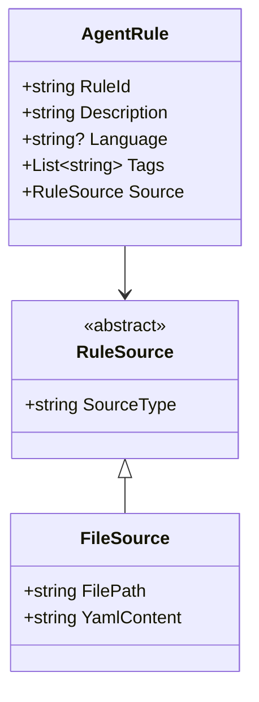

# System Patterns: AgentRulesHub

## Architecture Overview

### Core Data Models

## Key Technical Decisions

### 1. Abstract Source Pattern
- Used abstract RuleSource class to allow different source implementations
- Enables future expansion to other storage mechanisms
- FileSource as initial implementation for YAML-based storage

### 2. Nullable Language Property
- Language property is optional (nullable string)
- Allows rules to be either language-specific or language-agnostic

### 3. Tag-Based Categorization
- Rules can have multiple tags
- Facilitates flexible rule organization and retrieval
- Implemented as List<string> for simple manipulation

### 4. YAML Content Storage
- YAML chosen for rule content due to:
  - Human-readable format
  - Good structure support
  - Easy version control
  - Wide tool support

## Component Relationships
1. AgentRule serves as the primary entity
2. RuleSource provides abstraction for content storage
3. FileSource implements YAML file handling

## Critical Implementation Paths
1. Rule Creation: AgentRule -> RuleSource -> FileSource -> YAML file
2. Rule Retrieval: YAML file -> FileSource -> AgentRule
